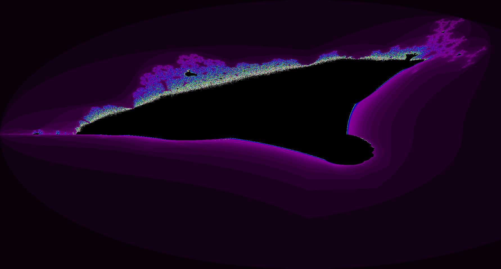
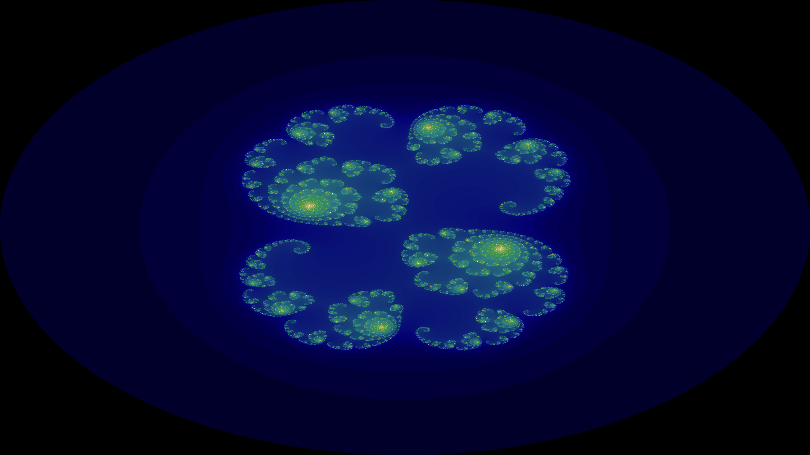
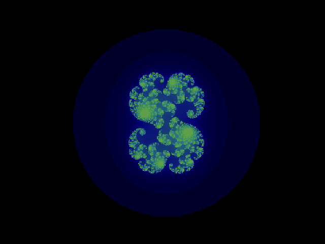
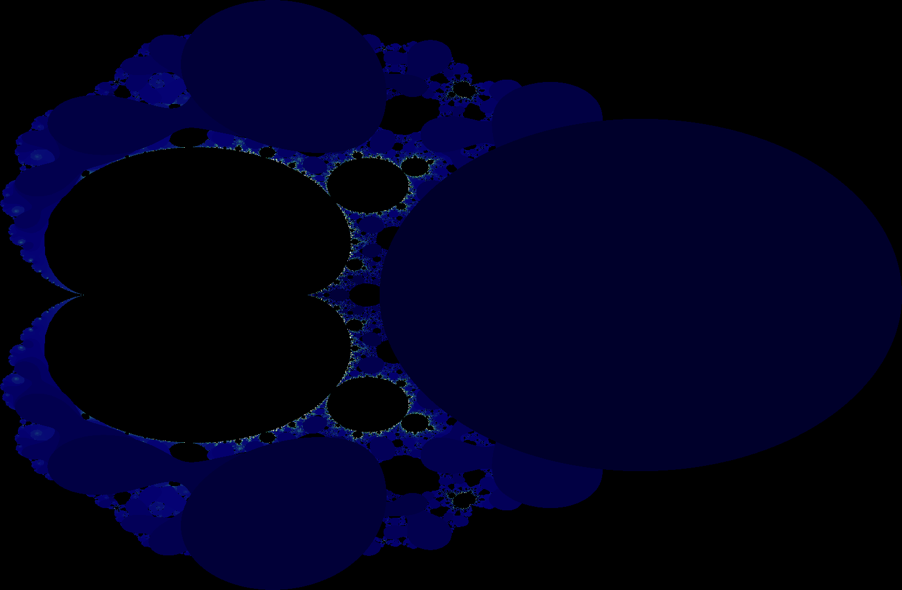
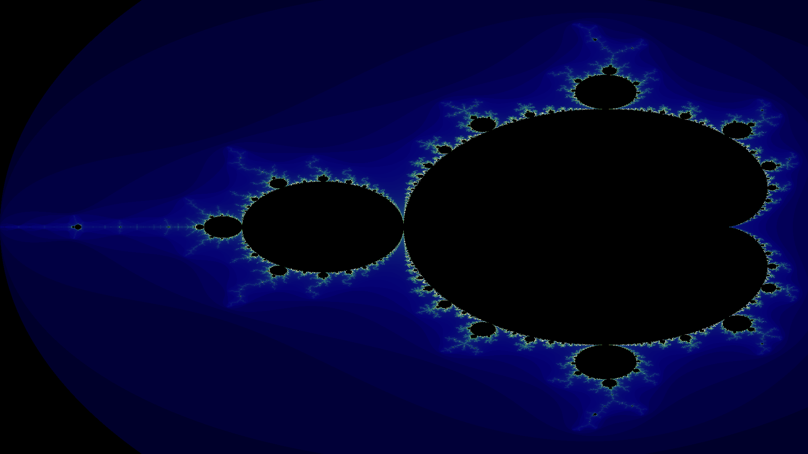

# Fractal
Homemade fractal art, powered by Python (meh...) and Numba (with JIT and multithread/GPU!).

## To generate .gif or .mp4 of rotating Julia sets
In a terminal, run :
python julia_anime.py -f your_file_name.gif

## To generate .gif or .mp4 of zooming Julia sets
python julia_zoom.py -f your_file_name.gif

## To generate .gif or .mp4 of 2d projection of quaternion Julia sets
In a terminal, run :
python julia_quaternion_print.py -f your_file_name.gif

All these functions support many more arguments, see source or command help.

# List of available fractals

##  Burning ship
Variant of Mandelbrot set with absolute value update function: https://en.wikipedia.org/wiki/Burning_Ship_fractal.

     
## Chaos game
Iterative fractal deformation of an initial shape: https://en.wikipedia.org/wiki/Chaos_game.

     

     
## Diffeobrot set
Continuous time analogue of the Mandelbrot equation:
dz(t)/dt + z(t) = z(t-t0)^2 + c, with z(0) = 0.

The diffeobrot set is the set of point c in the complex plane such that this system is stable. This varies with the delay parameter t0, more precisely the latter controls the "smoothness" of the resulting Mandelbrot-like set.

## Julia set 
Dual sets of the Mandelbrot set: https://en.wikipedia.org/wiki/Julia_set.

     
## Julia quaternion
Same definition as complex Julia sets, only applied with quaternion algebra. Visualization is projected from 4d to 3d via slicing, then displayed as a 2d moving shape.

     
## Magnetbrot
Yet another variation on Mandelbrot, this time with a rational update function rather than a polynomial one.
     

     
## Mandelbrot
Dual set of Julia sets: https://en.wikipedia.org/wiki/Mandelbrot_set.

